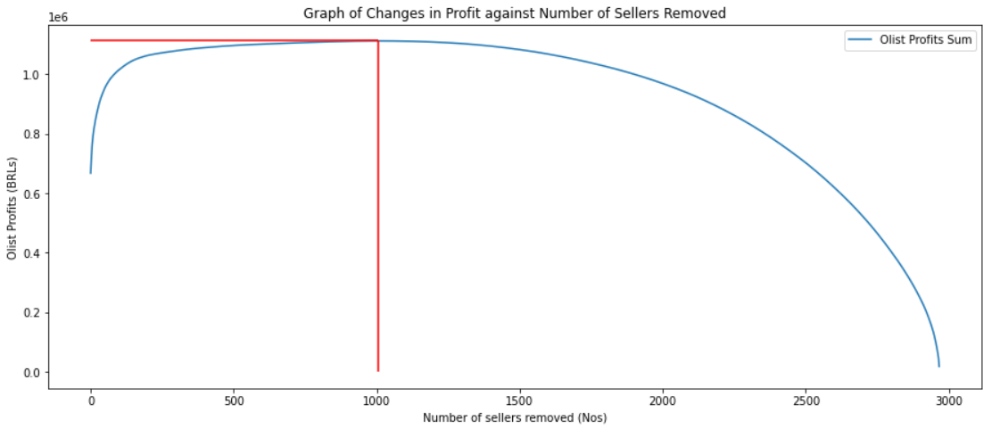
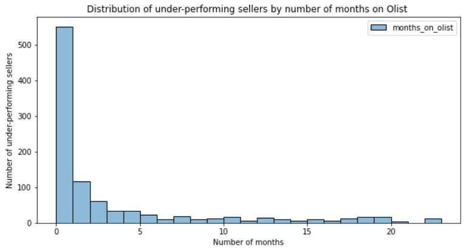
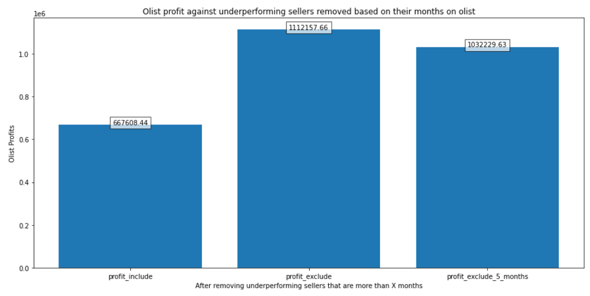

# Project Olist: Analysis & Recommendation for Olist
This project as an analysis of Olist and recommend ways to improve their profit margin. Olist is a Brazilian E-Commerce Platform which aims to empower digital retail and provide real growth opportunities for small, medium and large businesses. The analysis is conducted based on the public dataset given. It has information of 100k orders from 2016 to 2018 made at multiple marketplaces in Brazil.  

The mentioned public dataset is available in [Kaggle](https://www.kaggle.com/datasets/olistbr/brazilian-ecommerce). The challenge is in providing insights and finding out what has been holding olist from having higher profit margin from current situation.

# File Description
1. 1_Setup : Initial data preparation and exploration. We'll be checking the features available in order to determine the suitable metrics for business health and customer satisfaction.
2. 2_Statistical Inference : Starts to investigate into each dataset given to get an overview of current olist outlook. We'll be viewing all the relationships through graphs and finding the correlation between various features.
3. 3_Linear_Regression : After feature engineering and data wrangling, we used multivariate linear regression for a more accurate representation of the features. 
4. 4_Logistic_Regression : Multivariate logistic regression for finding the impact of **wait_time** and **delay_vs_expected** on very good/bad reviews. Finally provided recommendation and decide the increase in profit margin after the change.
5. data, img, olist : Contains raw data, image for report and .py files of all the notebooks. 
6. final analysis: The overall analysis after the causes has been identified. 

# Problem Statement
The task is to find out current business health, find out areas of concern that might have impacted olist current profit margin, and determine the increase in profit margin after adjustment.

# Assumption
**Revenue**
* Olist takes a 10% cut on the product price (excl. freight) of each order delivered.
* Olist charges 80 BRL by month per seller.

**Cost**
* Bad customer experience has business implications in the long run: low repeat rate, immediate customer support cost, refunds or unfavorable word of mouth communication. Therefore, we have an estimate measure of the monetary cost for each bad review:

Review_cost
* 1 star	100
* 2 stars	50
* 3 stars	40
* 4 stars	0
* 5 stars	0

IT_cost
* Olist’s total cumulated IT Costs to be proportional to the square-root of the total cumulated number of orders approved.
* The cumulated IT cost for IT department have amounted to 500,000 BRL since the birth of the marketplace until present day.

Analysis
We first accounted IT Cost into each orders as well as the additional monetary cost for each bad review to get the **net_profit** of each seller to date. We then sort then in an ascending order of their net_profit and calculate the max profit possible by removing under-performing sellers according to their net_profit.

  

Maximum profit possible is by removing all underperforming sellers, which will help Olist to increase their profit by 67% (additional 444,549.21 BRLs). When further investigate the sellers by the number of months on Olist, we found that 81.5% of the sellers are actually new to the platform. They just joined Olist around 5 months or less. 

  

Finally, we took 5 months as a final cut off point to check the effect of removing those underperforming sellers that are more than 5 months on the platform. The result is a 54.62% additional profit (364621.19 BRLs).

  

# Conclusion
Through brief analysis, by removing several most severe sellers ( sellers that actually causes loss instead of profit ), the profit margin of Olist can actually reach up to **54.62%**.  
Under-performing sellers that are new to Olist platform (those who join for around 5 months or less) are also identified, and management can decide to go for the next step as to reach out for helping them in further troubleshooting their business. Helping sellers to improve their business will be able to reduce the possible negative reviews, and thus improves customers perception of olists ecommerce platform as well. For the report on the full analysis, please refer to the **full_analysis.ipyb** notebook.

Moving forward, the bad reviews can be further analyzed by using NLP to determine why customers give bad and good reviews. The categorization of the bad reviews will help to identify what is the critical factor that will affect negative reviews for further identification and troubleshooting.
